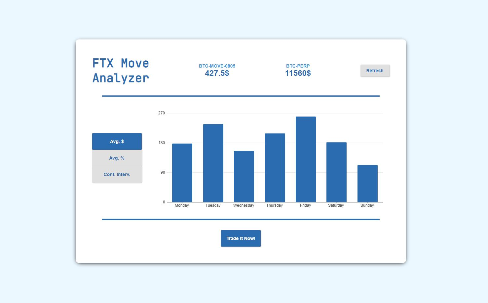

# FTX_MoveAnalyzer

A Flutter app to visualize historical datas for MOVE, a bitcoin derivatives product traded on FTX. You can see it on the repo's github pages here: https://wally869.github.io/FTX_MoveAnalyzer/

The app was made using the master branch of Flutter, so you can build on all platforms (desktop, mobile and web). See Build section below.  


Some Related Stuff:
- I thought about doing an app after seing romanornr's ftx-move-contracts golang algorithm. It's similar to this app, but on the CLI and with golang, [check it out!](https://github.com/romanornr/ftx-move-contracts)
- A small article on the method I used in setting the threshold for the confidence interval: https://www.noveltech.dev/anomaly-detection-python/ 




## Features  

- Current Price for closest Daily Move Contract and underlying index
- Average Price at expiry of Daily Move Contract per day in absolute $ terms and in percents
- Simple Anomaly Detection for % returns


I'd like to make use of the Confidence Interval chart to add a display of the implied expiry price. Still a WIP.

## Build & Run

Simply run the following commands:
```commandline
// To Run the App, with TARGET_PLATFORM one of the following (windows, macos, linux, chrome)
flutter run -d TARGET_PLATFORM

// or build
flutter build TARGET_PLATFORM
```

More details can be found here: https://flutter.dev/desktop

The app should be able to run on most mobile devices.

## To Do List

1- Add link github to gh-pages site  
2- No tooltip yet for charts  
3- Adjust legend and radius of scatterplot to width screen  
4- Use another library for charting. flutters chart is a mess for tooltips

## Known Issues
- Display will break down on iPhone 5/SE in landscape mode
- Scatterchart too cluttered on mobile
- Need to set adaptative legend dependent on screen width
- Scatterplot legend not enough width in mobile mode

